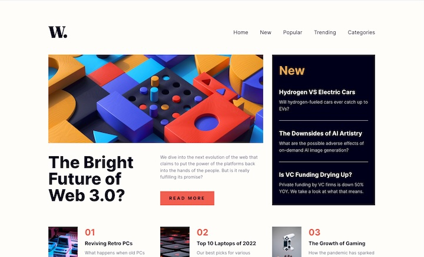
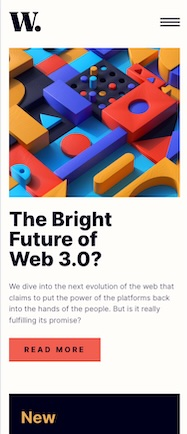

# Frontend Mentor - News homepage solution

This is a solution to the [News homepage challenge on Frontend Mentor](https://www.frontendmentor.io/challenges/news-homepage-H6SWTa1MFl). Frontend Mentor challenges help you improve your coding skills by building realistic projects. 

## Table of contents

- [Overview](#overview)
  - [The challenge](#the-challenge)
  - [Screenshot](#screenshot)
  - [Links](#links)
- [My process](#my-process)
  - [Built with](#built-with)
  - [What I learned](#what-i-learned)
  - [Continued development](#continued-development)
  - [Useful resources](#useful-resources)
- [Author](#author)
- [Acknowledgments](#acknowledgments)

## Overview

### The challenge

Users should be able to:

- View the optimal layout for the interface depending on their device's screen size
- See hover and focus states for all interactive elements on the page

### Screenshot

### Links

- [solution URL](https://github.com/kaaato/news-homepage-FM)
- [live site URL](https://kaaato.github.io/news-homepage-FM/)

## My process

### Built with

- Semantic HTML5 markup
- CSS custom properties
- Flexbox
- CSS Grid
- Mobile-first workflow

### What I learned

### Continued development

### Useful resources

- [resource 1](https://www.w3.org/WAI/ARIA/apg/patterns/disclosure/examples/disclosure-navigation-hybrid/#mythical-page-content) - for accessibility and structure of the patterns.
- [resource 2](https://components.publishing.service.gov.uk/component-guide/layout_super_navigation_header) - used as an example.

## Author

## Acknowledgments

